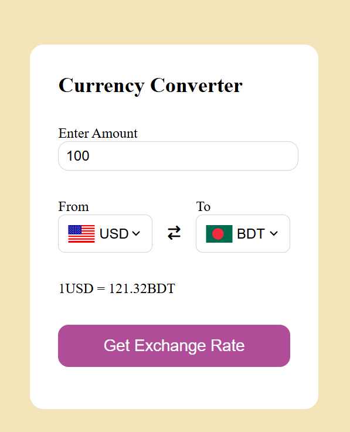

## ✅ Currency Converter

A simple and fast **Currency Converter** web application built using HTML, CSS, and JavaScript. Easily convert between different currencies in real-time and stay updated with the latest exchange rates.

## 🚀 Features
- 🔄 Convert between multiple currencies  
- 🌍 Real-time exchange rate updates via API  
- 💾 Saves last used conversion data (optional with local storage)  
- 📱 Responsive and easy-to-use interface

## 🛠 Tech Stack
HTML, CSS, JavaScript (Fetch API)

## 📷 Screenshots

## 📌 How to Use
1. Select the **from** and **to** currencies from the dropdowns.  
2. Enter the amount you want to convert.  
3. Click the **Convert** button to see the converted value.  
4. You can switch currencies and amounts anytime.
